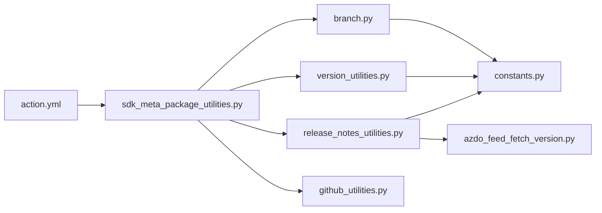
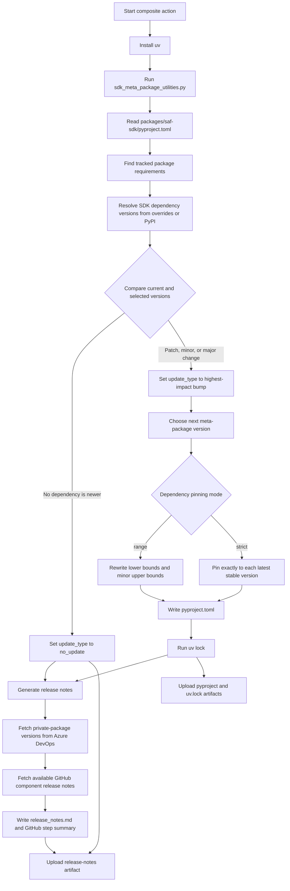
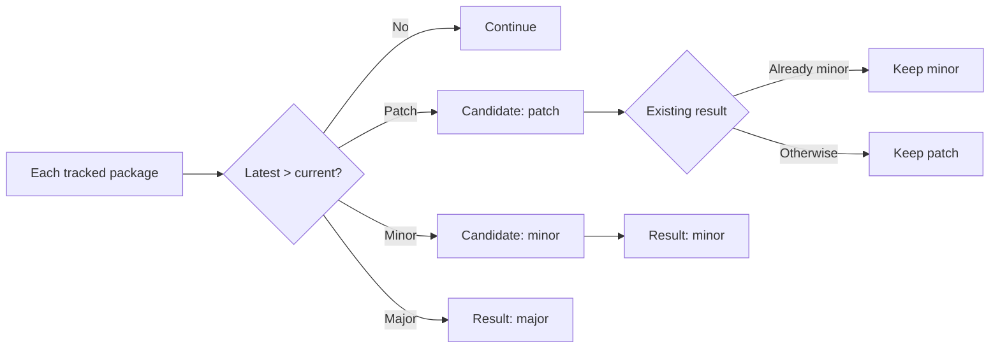
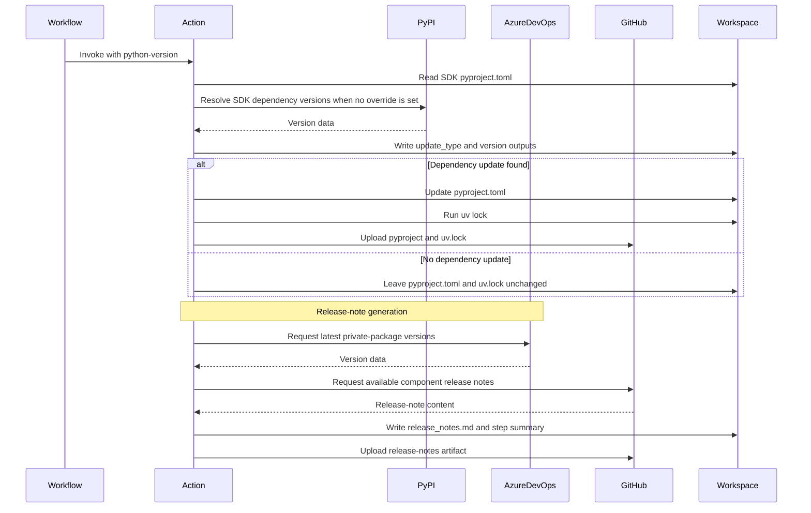

# SAF SDK Meta-Package Action

This local composite action updates and packages the `ansys-saf-sdk` meta-package. It
resolves the latest stable releases of SAF component packages from PyPI, updates the
dependency constraints in `packages/saf-sdk/pyproject.toml`, refreshes `uv.lock`, and
generates the repository-level `release_notes.md` summary. The summary also includes
the latest versions of selected private packages from an Azure DevOps feed.

## Usage

The action must run from a checked-out SAF repository with the SDK package available.
The calling workflow supplies the Python version and update policy. Version overrides
can be provided for release branches when a component version is not yet available
on PyPI:

```yaml
- name: Update pyproject.toml
  id: update-pyproject
  uses: ./.github/actions/sdk-meta-package
  with:
    python-version: ${{ vars.PYTHON_VERSION }}
    is-for-pypi-release: ${{ inputs.release }}
    meta-package-version-update-type: auto
    minimum-pip-version: "26.0"
    azure-devops-org: ${{ secrets.AZURE_DEVOPS_ORG }}
    azure-devops-feed: ${{ secrets.AZURE_DEVOPS_FEED }}
    azure-devops-pat: ${{ secrets.AZURE_DEVOPS_PAT }}
    ansys-bdm-api-version-override: ""
```

### Input

| Name | Required | Description |
| --- | --- | --- |
| `python-version` | Yes | Python version to use when running the meta-package update utility. |
| `is-for-pypi-release` | Yes | Indicates whether the current build is intended to publish the SDK package to PyPI. |
| `meta-package-version-update-type` | Yes | Requested version update type: `auto`, `major`, `minor`, or `patch`. |
| `minimum-pip-version` | Yes | Minimum pip version required to install the generated SDK meta-package. |
| `azure-devops-org` | Yes | Azure DevOps organization that hosts private-package versions. |
| `azure-devops-feed` | Yes | Azure DevOps feed that hosts private-package versions. |
| `azure-devops-pat` | Yes | Personal access token used to query the Azure DevOps feed. |
| `ansys-*-version-override` | No | Optional component version override. The action defines one override input for each tracked package; empty values use PyPI resolution. |

The override inputs are:
- `ansys-bdm-api-version-override`
- `ansys-bdm-shared-volume-version-override`
- `ansys-saf-glow-engine-version-override`
- `ansys-saf-desktop-installer-version-override`
- `ansys-saf-desktop-orchestrator-version-override`
- `ansys-iam-oidc-version-override`
- `ansys-saf-product-configuration-version-override`
- `ansys-saf-product-manager-version-override`

### Environment Variables

| Name | Values | Default | Description |
| --- | --- | --- | --- |
| `SAF_SDK_DEPENDENCY_PINNING` | `range`, `strict` | `strict` | Controls whether tracked dependencies use a compatible minor range or exactly the latest stable version. Invalid values fail the action. |

### Outputs

| Name | Values | Description |
| --- | --- | --- |
| `update-type` | `no_update`, `patch`, `minor`, `major` | Highest-impact update found among the tracked dependencies. |
| `version` | Semantic version | The next `ansys-saf-sdk` version. It is based on the published PyPI version, or `0.1.0` when the package has not yet been published. |

The output ID is the step ID `update-pyproject`, so a caller can reference
`${{ steps.update-pyproject.outputs.update-type }}` and
`${{ steps.update-pyproject.outputs.version }}`.

## How It Works

The action delegates the update logic to `sdk_meta_package_utilities.py` and runs it
with `uv run`. Before updating dependencies, `branch.py` validates the GitHub ref:
`release/vX.Y.Z/saf-sdk` branches are allowed only for `workflow_dispatch`; PyPI
releases are allowed only from `main` or an SDK release branch. The utility reads
package requirements from both the main dependency list and every optional dependency
group.

The implementation is split by responsibility:



`action.yml` defines the composite-action interface. The SDK utility coordinates
the update, `branch.py` validates branch context, `version_utilities.py` resolves
versions and dependency constraints, `release_notes_utilities.py` builds the report,
and calls `azdo_feed_fetch_version.py` to add private-package versions to that report.
`github_utilities.py` writes GitHub Actions outputs.



The tracked packages are the SAF libraries listed in `PACKAGE_LIBRARY_DIRS`. Other
requirements in the SDK project remain unchanged. By default, each tracked requirement
is pinned to the exact latest stable version:

```text
ansys-saf-product-manager==0.5.0
```

Set `SAF_SDK_DEPENDENCY_PINNING=range` to use a compatible minor-version range instead:

```text
ansys-saf-product-manager>=0.5.0,<0.6.0
```

Changing the pinning mode rewrites `pyproject.toml` and refreshes `uv.lock` even when
no newer dependency was found. A pinning-only change does not bump the SDK package
version.

The update precedence is major over minor over patch. The highest-impact update found
across all tracked packages becomes the selected update type.



## Files and Artifacts

The utility writes these repository files:

- `packages/saf-sdk/pyproject.toml`: updated when a tracked package version or dependency pinning constraint changes.
- `packages/saf-sdk/uv.lock`: refreshed after `pyproject.toml` changes.
- `release_notes.md`: regenerated on every run with resolved package versions and any available component release notes.

The action uploads:

- `release-notes`, always.
- `pyproject`, only when `update-type` is not `no_update`.
- `uv-lock`, only when `update-type` is not `no_update`.



## Release Notes

After resolving SDK dependency versions, the action generates the release-note report.
It first retrieves the latest non-deleted version of each configured private package
from Azure DevOps; these versions are informational and do not change SDK dependency
constraints or the selected SDK version. For each resolved SDK component package, the
utility then looks for a GitHub release tagged as
`v{version}-{library-directory}`. If the release exists, content from its `What's
changed` section is included in `release_notes.md` when the package version has changed
since the last release of `ansys-saf-sdk`. If the resolved version is the same as the
current SDK dependency version, the package section contains `No changes`. The generated
dependency table lists each tracked package and its resolved version. Missing release
notes for an updated component do not fail the run; HTTP errors other than `404` are
propagated.

The generated section starts with a warning not to edit it manually. A later workflow
can use the `update-type` and `version` outputs to decide whether to create a release
or publish the built SDK wheel.

The dependency table contains the tracked SAF packages resolved from PyPI. A separate
private-package table lists the latest non-deleted version from the configured Azure
DevOps feed for `ansys-saf-pim-light-server`, `ansys-translation-utilities`,
`ansys-saf-desktop-portal`, `ansys-saf-web-portal`,
`ansys-minerva-python-client`, `ansys-datarepository-python-client`,
`ansys-saf-hermes`, and `ansys-saf-aspire`. Stable versions are preferred; the latest
pre-release is used only when no stable version is available.

## Failure Behavior

- A missing PyPI package is treated as unpublished, and the initial SDK version is used.
- A missing GitHub release produces no package release-note section.
- A missing, inaccessible, or invalid Azure DevOps private package fails release-note generation.
- Invalid branch, update-type, pinning, or requirement data fails the action.
- Network errors from PyPI, Azure DevOps, or GitHub fail the action unless the GitHub response is an expected `404`.

## Testing

Run all action tests from the repository root:

```bash
uv run .github/actions/sdk-meta-package/tests/run_tests.py
```
