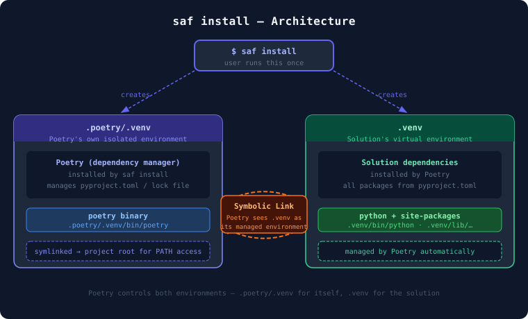
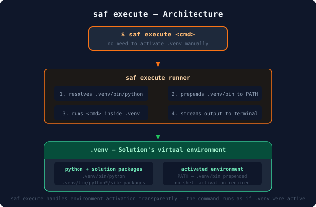

.. _ug-install:

Install
########

Installing a solution involves updating the solution's dependencies and setting up a virtual environment.

This process is required when you have created a new solution. You may also want to install a solution environment when you:

* Open a solution in a new workspace for the first time
* Want to refresh or recreate the existing environment
* Have made significant changes to dependencies

Install the solution environment
================================

.. tab-set::

    .. tab-item:: SAF CLI

        Install the solution environment using SAF CLI.

        .. tab-set::

            .. tab-item:: From the solution's root directory

                .. code-block:: bash

                    saf install -f

            .. tab-item:: From anywhere

                .. code-block:: bash

                    saf install <app_name> -f

    .. tab-item:: Solutions Manager

        Install the solution environment using Solutions Manager.

        #. Open Visual Studio Code.

        #. In the Activity Bar, click the **Solutions Manager** icon.

        #. In the **Solutions Manager** pane, expand the **Setup Solution** view.

           .. image:: /_static/images/solutions_manager_setup_solution_view.png
             :alt: Solutions Manager Setup Solution view
             :width: 50%

        #. Provide the following values:

           a. Select the solution you want to install.

              You can either select an option from the list of available solutions or browse for the solution folder of a different one.

           b. Select an environment cleanup option.

              You can either use the default option (**No clean-up**) or select a different one.

        #. Set up the environment.

           Click the :guilabel:`Setup solution environment` button. Alternatively, you can copy the command under **Solution setup command** and run it in the terminal.

The installation installs all necessary dependencies. You can monitor its progress in the terminal.

.. seealso::
    For more detailed information on the installation process, see :ref:`ug-install-saf-command`.

.. _ug-install-saf-command:

The ``saf install`` command
----------------------------

The ``saf install`` command sets up the solution's virtual environment within the application root directory, installs Poetry, and uses it to install the dependencies defined in the application's ``pyproject.toml`` file.

.. _ug-install-saf-command-options:

``saf install`` options
------------------------

The ``saf install`` command has multiple options. To see them all, run the following command:

.. code-block:: text

   saf install --help

The following ``saf install`` options are available:

.. list-table::
   :header-rows: 1
   :stub-columns: 1
   :widths: 25 55 20

   * - Option
     - Description
     - Default value

   * - ``-F``, ``--force-clear-all``
     - Cleans up the workspace by deleting the existing ``.venv``, ``.poetry/.venv``, ``.poetry/.cache``, and ``poetry.lock``.
     - Disabled

   * - ``-f``, ``--force-clear``
     - Cleans up the workspace by deleting the existing ``.venv``, ``.poetry/.venv``, and ``.poetry/.cache``.
     - Disabled

   * - ``--env-file``
     - Loads environment variables from this file.
     - ``.env`` in the application root directory, if present

   * - ``-d``, ``--dependencies``
     - List of dependency groups to install, separated by commas.

       For more detailed information on dependency packages and groups, see :ref:`ug-install-dependency-groups`.

     - ``desktop,ui,doc,build``

Virtual environment installation
--------------------------------

Under the hood, ``saf install`` creates two isolated virtual environments:

- ``.poetry/.venv``: Poetry's own environment, keeping the dependency manager separate from the solution.
- ``.venv``: The solution's virtual environment, managed by Poetry and populated with all packages from ``pyproject.toml``.

A symbolic link connects the two so that Poetry can transparently manage ``.venv`` without conflicts, as illustrated in the following diagram:

.. attention::

    **Private sources:** If your application's ``pyproject.toml`` file declares a private source, you are prompted to provide credentials during installation.

    The system validates your credentials and securely stores them as user-level environment variables for future use. If invalid credentials are provided, you are prompted to re-enter them. You can cancel the credential prompt at any time by pressing :kbd:`Ctrl+C`.

    For more detailed information, see :ref:`user_guide_install_manage_private_sources`.

.. _ug-install-dependency-groups:

Solution dependency groups
---------------------------
Poetry supports the concept of dependency groups, which are sets of packages that can be installed together. This allows you to install only the dependencies you need for a particular use case, such as development, testing, or documentation.

Solution dependencies defined in the ``pyproject.toml`` file are organized into groups that can be installed selectively using the ``-d/--dependencies`` option of the ``saf install`` command.

Main dependencies
~~~~~~~~~~~~~~~~~

The packages listed under ``[tool.poetry.dependencies]`` in ``pyproject.toml`` (the runtime or "main" dependencies) are always installed by ``saf install``. These are not a named dependency group---they are the project's direct dependencies, such as ``ansys-saf-glow-engine`` and ``ansys-saf-product-manager`` in the solution template.

Default optional groups
~~~~~~~~~~~~~~~~~~~~~~~

By default, ``saf install`` also requests the optional dependency groups ``desktop``, ``ui``, ``doc``, and ``build`` when they are defined in the project's ``pyproject.toml``.

Additional optional groups
~~~~~~~~~~~~~~~~~~~~~~~~~~

Other optional groups may be defined for a project. In the solution template, ``tests`` and ``style`` are available but are not installed by default.

Control which groups are installed
~~~~~~~~~~~~~~~~~~~~~~~~~~~~~~~~~~~

* To specify which optional groups to install, use the ``-d/--dependencies`` option with ``saf install``. For multiple groups, provide a comma-separated list of group names.
  For example, to install only the ``tests`` and ``style`` groups, use:

  .. code-block:: bash

      saf install -d tests,style

* If you pass ``-d`` with a specific list, only the listed optional groups are requested in addition to the main dependencies. The default selection is not implicitly merged---if you want the defaults, you must include them explicitly.
  For example, to install the default groups plus ``tests``, use:

  .. code-block:: bash

       saf install -d desktop,ui,doc,build,tests

* To install every optional group defined in the project, use ``-d all`` with ``saf install``:

  .. code-block:: bash

      saf install -d all

.. note::

    Subsequent runs of ``saf install`` that specify additional dependency groups can only add packages to the environment; they do not remove already-installed packages.

    To create a clean environment containing only a given set of groups, use the ``-f`` (force-clear) option together with ``-d``. This deletes the existing virtual environment and recreates it with the requested groups.

.. _user_guide_install_manage_dependencies:

Manage solution dependencies
==============================

Managing dependencies involves adding, updating, or removing individual packages in a solution's virtual environment, and keeping the environment reproducible and consistent with the packages declared in its ``pyproject.toml`` file.

Both SAF CLI and Solutions Manager manage dependencies by driving Poetry, the dependency management system used by SAF solutions. You can use either method, depending on your preference and workflow.

.. tab-set::

    .. tab-item:: SAF CLI

        To use SAF CLI to add, update, or remove individual packages, run Poetry commands inside the solution's virtual environment.

    .. tab-item:: Solutions Manager

        To manage dependencies using the **Dependencies** view:

        #. Open the solution's root directory in Visual Studio Code.

        #. In the Activity Bar, click the **Solutions Manager** icon.

        #. In the **Solutions Manager** pane, expand the **Dependencies** view.

           .. image:: /_static/images/solutions-manager-dependencies-view.png
              :alt: Solutions Manager Dependencies view
              :width: 45%

           The dependency groups shown are populated from the solution's ``pyproject.toml`` file. Expand a group to view the packages installed in the solution environment.

           .. note::
               Packages installed from a private source are marked with a lock icon. For more information, see :ref:`user_guide_install_manage_dependencies_private_packages`.

           .. tip::
               If the environment falls out of sync with ``pyproject.toml`` or ``poetry.lock`` (for example, after a manual edit), the view shows a warning. To reconcile the environment, click :guilabel:`Sync Dependencies` or the sync icon in the view's title bar.

.. seealso::
    For more information about using Poetry for dependency management, see the official `Poetry <https://python-poetry.org/docs/>`_ documentation.

.. _user_guide_install_manage_dependencies_add:

Add a dependency
------------------

.. tab-set::

    .. tab-item:: SAF CLI

        To add a dependency using Poetry, run ``poetry add`` inside the solution's environment.

        .. seealso::
            For the full set of ``poetry add`` options, see the official Poetry `add <https://python-poetry.org/docs/cli/#add>`_ command documentation.

    .. tab-item:: Solutions Manager

        To add a dependency using Solutions Manager:

        #. In the **Dependencies** view title bar, click the **Add Dependency** icon.

           .. image:: /_static/images/solutions-manager-dependencies-add-button.png
            :alt: Add Dependency icon in the Dependencies view title bar
            :width: 45%

        #. In the field above the editor, enter the name of the package you want to add.

           .. image:: /_static/images/solutions-manager-dependencies-add-package-name.png
            :alt: Add package name field
            :width: 100%

        #. In the field above the editor, enter a package version constraint (optional).

           Leave this field empty to let Poetry select the latest compatible version.

           .. image:: /_static/images/solutions-manager-dependencies-add-package-version.png
            :alt: Add package version constraint field
            :width: 100%

           For more information about version values, see :ref:`user_guide_install_manage_dependencies_versions`.

        #. In the dropdown list above the editor, select a dependency group.

           .. image:: /_static/images/solutions-manager-dependencies-select-group.png
            :alt: Select dependency group dropdown
            :width: 100%

           .. note::

            This list doesn't include ``desktop`` or any custom groups defined in ``pyproject.toml``. To add a dependency to one of those groups, use SAF CLI instead.

            Solutions Manager runs the equivalent ``poetry add`` command and shows a progress notification, followed by a success or failure message.

        #. Expand the group containing the new package and verify that the new package is visible.

.. _user_guide_install_manage_dependencies_update:

Update a dependency
----------------------

.. tab-set::

    .. tab-item:: SAF CLI

        To update a dependency using Poetry, run ``poetry update`` inside the solution's environment.

        .. seealso::
            For the full set of ``poetry update`` options, see the official Poetry `update <https://python-poetry.org/docs/cli/#update>`_ command documentation.

    .. tab-item:: Solutions Manager

        #. In the **Dependencies** view, expand the group containing the package you want to update.

        #. Click the package's **Update Dependency** icon.

           .. image:: /_static/images/solutions-manager-dependencies-update-button.png
            :alt: Update Dependency icon
            :width: 45%

        #. In the confirmation dialog at the bottom right corner of the window, click :guilabel:`Yes`.

           Solutions Manager runs the equivalent ``poetry update`` command and shows a progress notification, followed by a success or failure message.

        #. Verify that the package version has been updated.

.. note::

    Updating a dependency does not prompt for or accept a version. It updates the package to the latest version allowed by its existing constraint in ``pyproject.toml``, but does not change that constraint. To change a version constraint, add the dependency again with the new constraint, as described in :ref:`user_guide_install_manage_dependencies_add`.

.. _user_guide_install_manage_dependencies_remove:

Remove a dependency
----------------------

.. tab-set::

    .. tab-item:: SAF CLI

        To remove a dependency using Poetry, run ``poetry remove`` inside the solution's environment.

        .. seealso::
            For the full set of ``poetry remove`` options, see the official Poetry `remove <https://python-poetry.org/docs/cli/#remove>`_ command documentation.

    .. tab-item:: Solutions Manager

        #. In the **Dependencies** view, expand the group containing the package you want to remove.

        #. Click the package's **Remove Dependency** icon.

           .. image:: /_static/images/solutions-manager-dependencies-remove-button.png
            :alt: Remove Dependency icon on a package row
            :width: 45%

        #. In the confirmation dialog at the bottom right corner of the window, click :guilabel:`Yes`.

           Solutions Manager runs the equivalent ``poetry remove`` command and shows a progress notification, followed by a success or failure message.

        #. Verify that the package is no longer visible in the group from which it was removed.

.. _user_guide_install_manage_dependencies_versions:

Version constraints
--------------------

When adding a dependency, you specify a version constraint that tells Poetry which versions of the package are acceptable. Commonly used formats include:

* **Exact version**: ``1.0.0`` or ``1.0``
* **Caret requirement**: ``^1.0.0`` (allows releases that don't change the leftmost non-zero version component)
* **Tilde requirement**: ``~1.0.0`` (allows patch-level updates within the same minor version)
* **Comparison operators**: ``>=1.0.0``, ``<=1.0.0``, ``>1.0.0``, ``<1.0.0``
* **Development version**: ``0.1dev1``

.. note::

    The Solutions Manager **Add Dependency** version field accepts only the formats listed above. To use a constraint outside this set, use SAF CLI instead. For the full syntax, including wildcards, multiple constraints, and pre-release versions, see the official Poetry `Dependency specification <https://python-poetry.org/docs/dependency-specification/>`_ documentation.

.. _user_guide_install_manage_dependencies_private_packages:

Private packages
------------------

Dependencies installed from a private source, such as the PyAnsys private PyPI index, require authentication.

Before you add, update, or remove a private package, valid credentials for its source must already be available, as described in :ref:`user_guide_install_manage_private_sources`. Neither SAF CLI nor Solutions Manager prompts for credentials as part of these actions.

.. note::
    In Solutions Manager, these packages are marked with a lock icon in the **Dependencies** view.
    The **Add Dependency** command does not specify a source explicitly.

.. _ug-install-execute-commands:

Execute commands in the solution environment
=============================================

Once a solution is installed, you can use ``saf execute`` to run commands inside its virtual environment. This lets you invoke tools such as ``pytest``, ``sphinx-build``, or any other command without manually activating the solution's virtual environment beforehand.

.. code-block:: text

   saf execute <solution_name> "<command>"

.. _ug-install-saf-execute-command:

The ``saf execute`` command
----------------------------

The ``saf execute`` command prepends the solution's ``.venv`` to :envvar:`PATH`, so the solution's Python
interpreter and installed packages take precedence over any other environment on the system.

.. warning::

   If the binary called in ``<command>`` is not present in the solution's environment, binaries
   found in other environments on :envvar:`PATH` are used as a fallback.

.. _ug-install-saf-execute-options:

``saf execute`` options
-----------------------

The ``saf execute`` command has multiple options. To see them all, run the following command:

.. code-block:: text

   saf execute --help

The following ``saf execute`` options are available:

.. list-table::
   :header-rows: 1
   :stub-columns: 1
   :widths: 20 40 40

   * - Option
     - Description
     - Default value

   * - ``--cwd``
     - Directory in which the command is executed.
     - Solution's root directory

   * - ``--env-file``
     - Loads environment variables from this file.
     - ``.env`` in the solution root directory, if present

.. _ug-install-saf-execute-example:

Command execution example
--------------------------

This example illustrates how to run a solution's test using the ``saf execute`` command. The command runs ``pytest`` in the solution's virtual environment, using the solution's Python interpreter and installed packages.

.. code-block:: bash

   saf execute my-solution "pytest -v"

.. tip::
   To pass a command that itself contains spaces or quoted strings, wrap the inner string in single quotes:

   .. code-block:: bash

      saf execute my-solution "python -c 'from datetime import datetime; print(datetime.now())'"

.. _user_guide_install_manage_private_sources:

Manage private sources
========================

For applications that use private sources that require authentication, you can pre-configure credentials to avoid interactive prompts during installation.

.. rubric:: Credential precedence order

The system follows a specific **order of precedence** when looking for credentials:

1. **User session environment variables** (highest priority)
2. **Application-specific .env file** (lower priority)

If credentials are found at any level, they are validated. If validation fails, you are prompted to enter new credentials interactively.

.. rubric:: Environment variable naming convention

The environment variable names are derived from the source name declared in your application's ``pyproject.toml`` file. Given a source name like ``my-private-source``, the
corresponding environment variables are:

* Username variable: :envvar:`POETRY_HTTP_BASIC_MY_PRIVATE_SOURCE_USERNAME`
* Password variable: :envvar:`POETRY_HTTP_BASIC_MY_PRIVATE_SOURCE_PASSWORD`

(Recommended) Set user session environment variables
-----------------------------------------------------

Set environment variables at the user-session level for persistent, system-wide access:

.. tab-set::

    .. tab-item:: Windows (PowerShell)

        .. code-block:: powershell

            # Example for a 'my-private-source' source
            # Set user-level environment variables (persists across sessions)
            [Environment]::SetEnvironmentVariable("POETRY_HTTP_BASIC_MY_PRIVATE_SOURCE_USERNAME", "your-username", "User")
            [Environment]::SetEnvironmentVariable("POETRY_HTTP_BASIC_MY_PRIVATE_SOURCE_PASSWORD", "your-token", "User")

            # Or using setx command
            setx POETRY_HTTP_BASIC_MY_PRIVATE_SOURCE_USERNAME "your-username"
            setx POETRY_HTTP_BASIC_MY_PRIVATE_SOURCE_PASSWORD "your-token"

    .. tab-item:: Linux/macOS

        .. code-block:: bash

            # Example for a 'my-private-source' source
            # Add to your shell profile (for example, ~/.bash_profile, ~/.bashrc, or ~/.profile)
            export POETRY_HTTP_BASIC_MY_PRIVATE_SOURCE_USERNAME="your-username"
            export POETRY_HTTP_BASIC_MY_PRIVATE_SOURCE_PASSWORD="your-token"

            # Reload your profile
            source ~/.bash_profile

.. note::
    User session environment variables are the **preferred method** because they:

    * Apply to all applications that use the same private PyPI source
    * Persist across terminal sessions
    * Don't require management of multiple ``.env`` files

Use an application-specific environment file
---------------------------------------------

Edit the ``.env`` file in your application root directory for project-specific credentials:

.. code-block:: bash

    POETRY_HTTP_BASIC_MY_PRIVATE_SOURCE_USERNAME=john.doe
    POETRY_HTTP_BASIC_MY_PRIVATE_SOURCE_PASSWORD=your-access-token

Use custom environment files
~~~~~~~~~~~~~~~~~~~~~~~~~~~~

.. code-block:: bash

    # Use a custom environment file location
    saf install <app_name> --env-file /path/to/custom.env

Find your source name
~~~~~~~~~~~~~~~~~~~~~

Check your application's ``pyproject.toml`` file for the source configuration:

.. code-block:: toml

    [tool.poetry.source]
    name = "my-private-source"
    url = "https://your-pypi-server.com/simple/"
    priority = "primary"

Environment variable naming rules
----------------------------------

- Replace hyphens with underscores: :envvar:`my-company-pypi` → :envvar:`MY_COMPANY_PYPI`
- Add the Poetry prefix and suffix: :envvar:`POETRY_HTTP_BASIC_<SOURCE_NAME>_USERNAME/PASSWORD`

Credential precedence example
--------------------------------

If you have both user session variables and a ``.env`` file for the ``my-private-source`` source:

.. code-block:: bash

    # User session (takes precedence)
    POETRY_HTTP_BASIC_MY_PRIVATE_SOURCE_USERNAME=session-user

    # .env file (ignored for username, used for password)
    POETRY_HTTP_BASIC_MY_PRIVATE_SOURCE_USERNAME=env-file-user
    POETRY_HTTP_BASIC_MY_PRIVATE_SOURCE_PASSWORD=env-file-token

.. admonition:: Result

    ``session-user`` with ``env-file-token`` is used.

.. seealso::

    If the installation fails, see :ref:`troubleshooting_installation` for common problems and their workarounds.
    On machines behind a corporate proxy or a TLS-inspecting firewall, see also
    :ref:`troubleshooting_corporate_environment`.

