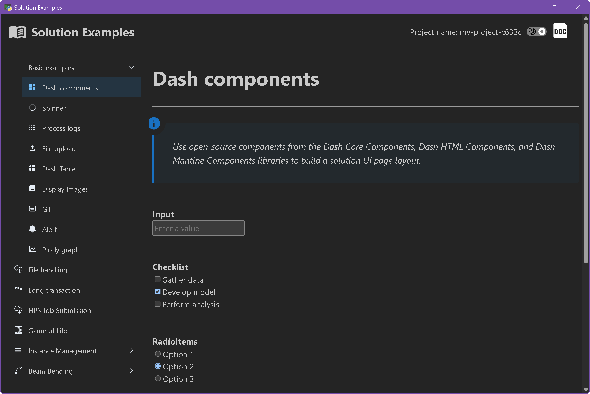

# Solution Examples

<p align="left">
    <br />
    
</p>

The **Solution Examples** solution provided in the `saf/examples` directory demonstrates select SAF examples. Follow these instructions to install and run the solution.


## Prerequisites

- Visit the SAF documentation and ensure that you've fulfilled all [prerequisites](https://saf.ansys.com/version/stable/getting_started/prerequisites/index.html).

- You've created a local clone of the [`saf`](https://github.com/ansys/saf) repository.


## Install the example solution


1. In your local clone of the `saf` repository, move to the ``examples`` folder:

    ```bash
    cd examples
    ```

2. Install the example solution:

    ```bash
    saf install -f
    ```

## Run the example solution

In the `examples` folder, run the following command:

```bash
saf run
```

The Solution Examples solution opens to the first example. Available examples are shown in the left sidebar.



<!--  -->


# License

Copyright (c) ANSYS Inc. All rights reserved.

