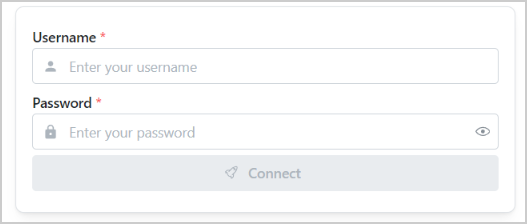
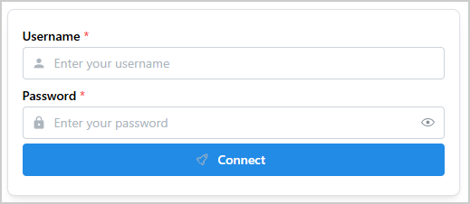
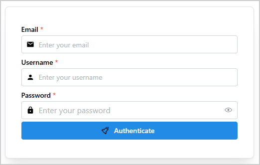

.. _ref_authenticator:

Authenticator
#############

``Authenticator`` is a Dash All-in-One (AIO) component for creating authentication forms. It
supports both a default configuration and a fully customizable form with user-defined fields.

Key features:

- **Default mode**: Pre-configured form with a username field, a password field, and a connect
  button.
- **Custom mode**: Fully customizable form items with user-defined fields and types.
- **Callback integration**: Component IDs are accessible for implementing custom business logic
  such as enabling or disabling the connect button based on input.

Usage
=====

Basic usage
-----------

Import ``Authenticator``:

.. code-block:: python

   from ansys.solutions.dash_super_components import Authenticator

Add an ``Authenticator`` component to your page layout:

.. literalinclude:: ../../../examples/user_guide/example_authenticator.py
   :language: python
   :start-after: # [basic-layout-start]
   :end-before: # [basic-layout-end]

The following output is expected:

By default, the ``Authenticator`` component comes with three items:

- Username field.
- Password field.
- Connect button.

Advanced usage
--------------

In most cases, the authentication form needs to be customized to fit the business needs.
``Authenticator`` enables for a full customization of the form.

Import ``Authenticator``, ``IconNames``, and ``create_base64_svg_src``:

.. code-block:: python

    from ansys.solutions.dash_super_components import Authenticator
    from ansys.solutions.dash_super_components.utils.svg_icons import IconNames, create_base64_svg_src

.. note::

    The ``create_base64_svg_src()`` utility produces offline-compatible icons. For information
    about the available icon options and their advantages, see :ref:`ref_icons`.

In the layout function of the page, define the structure of the authentication form and add the
``Authenticator`` component:

.. literalinclude:: ../../../examples/user_guide/example_authenticator.py
   :language: python
   :start-after: # [advanced-layout-start]
   :end-before: # [advanced-layout-end]

Each item of the ``authentification_form_items`` list defines a field in the authentication form.
You can add as many fields as necessary.
:ref:`This table <authentificator_item_definition_properties>` lists the authorized keys for the
item definition.

The following output is expected:

Turning off the connect button until all required fields are filled
-------------------------------------------------------------------

All items of the ``Authenticator`` component can be accessed in a callback function to customize the
look and feel or implement a business logic. For details about the component IDs used in the
callbacks to access the items, see the :ref:`authenticator_component_ids` section.

For instance, you might want to turn off the connect button until the username and password fields
get populated. Here is an example callback function to achieve this with the default configuration:

.. literalinclude:: ../../../examples/user_guide/example_authenticator.py
   :language: python
   :start-after: # [button-callback-start]
   :end-before: # [button-callback-end]

Properties
==========

Custom form item keys
---------------------

.. _authentificator_item_definition_properties:

.. vale Google.Quotes = NO
.. vale Google.Spacing = NO

==========  ====================================================================  ======  ========
Key         Description                                                           Type    Required
==========  ====================================================================  ======  ========
id          A unique identifier of the item.                                      string  Yes
type        The input type: "TextInput", "PasswordInput" or "Button".             string  Yes
properties  The properties of the item. See `dmc.TextInput                        dict    Yes
            <https://www.dash-mantine-components.com/components/textinput>`_,
            `dmc.PasswordInput
            <https://www.dash-mantine-components.com/components/passwordinput>`_
            and `dmc.Button
            <https://www.dash-mantine-components.com/components/button>`_
            properties.
==========  ====================================================================  ======  ========

.. vale Google.Quotes = YES
.. vale Google.Spacing = YES

Constructor parameters
----------------------

============ ============================================================= ======= ========
Name         Description                                                   Type    Required
============ ============================================================= ======= ========
items        The list of items to render in the authentication form.       list    No
card_props   The properties of the card component of the authentication    dict    No
             form.
aio_id       The unique identifier of the component. If not provided, a    string  No
             UUID is generated.
============ ============================================================= ======= ========

.. _authenticator_component_ids:

Component IDs
-------------

The component exposes the following IDs for use in callbacks:

- ``Authenticator.ids.input(aio_id, item_id)``: A ``TextInput`` item
- ``Authenticator.ids.password(aio_id, item_id)``: A ``PasswordInput`` item
- ``Authenticator.ids.button(aio_id, item_id)``: A ``Button`` item

The IDs are indexed by the ``aio_id`` of the component and the item id (``item["id"]``).
For the default configuration (no ``items`` list provided), the default item IDs are:

- ``Authenticator.ids.input(aio_id, "username")``: The username text input component
- ``Authenticator.ids.password(aio_id, "password")``: The password input component
- ``Authenticator.ids.button(aio_id, "connect")``: The connect button component

Full example
============

Check out this `example <https://github.com/ansys/super-components-for-dash/blob/main/examples/showcase_all/src/ansys/solutions/showcase_dash_super_components/ui/pages/authenticator_page.py>`_
to learn how to use ``Authenticator``.

The example demonstrates:

- A default authentication form with username, password, and a connect button
- A custom authentication form with email, username, and password fields decorated with
  left-section icons, plus a custom authenticate button
- A status badge that updates on form submission
- Enabling or disabling the submit button based on whether all required fields are filled

For a minimal self-contained runnable example, see the
:ref:`sphx_glr_examples_general_example_authenticator.py` page in the Examples gallery.

Source code
===========

For the full API reference of ``Authenticator``, see
:class:`~ansys.solutions.dash_super_components.Authenticator`.

Check out the `component source code <https://github.com/ansys/super-components-for-dash/blob/main/src/ansys/solutions/dash_super_components/authenticator.py>`_
to discover the underlying logic. Contributions are welcomed. You can extend the component
functionalities by raising a pull request in the
`super-components-for-dash <https://github.com/ansys/super-components-for-dash>`_ repository.
