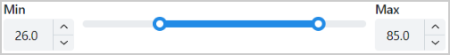
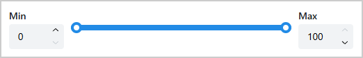
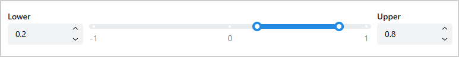

.. _ref_dual_input_range_slider:

Dual Input Range Slider
#######################

``DualInputRangeSlider`` is a Dash All-in-One (AIO) component that integrates a range slider with
two number input fields for precise control of lower and upper bound values. It provides a
dual-control interface where users can adjust values by dragging the slider handles or typing
directly into the input fields.

Key features:

- **Dual control interface**: Range slider with synchronized number inputs
- **Bidirectional updates**: Changes in slider update inputs, and vice versa
- **Automatic validation**: Ensures lower bound never exceeds upper bound
- **Customizable precision**: Configurable decimal places for numeric inputs
- **Flexible styling**: Customizable appearance for slider and input fields

Usage
=====

Basic usage
-----------

Import ``DualInputRangeSlider``:

.. literalinclude:: ../../../examples/user_guide/example_dual_input_range_slider.py
   :language: python
   :start-after: # [imports-start]
   :end-before: # [imports-end]

Add ``DualInputRangeSlider`` to the page layout:

.. literalinclude:: ../../../examples/user_guide/example_dual_input_range_slider.py
   :language: python
   :start-after: # [basic-layout-start]
   :end-before: # [basic-layout-end]

The following output is expected:

Advanced usage
--------------

Customize the component with custom ranges, precision, and styling:

.. literalinclude:: ../../../examples/user_guide/example_dual_input_range_slider.py
   :language: python
   :start-after: # [advanced-layout-start]
   :end-before: # [advanced-layout-end]

The following output is expected:

How it works
------------

1. **Initialization**: The component is created with required min and max values, plus optional
   step, decimal_scale, and initial value settings
2. **Slider Control**: Dragging the slider handles updates both the slider value and the
   corresponding number inputs
3. **Input Control**: Typing a new value in either number input and committing it (blur or
   Enter) updates the slider position. The inputs use ``debounce`` to avoid triggering callbacks
   on every keystroke.
4. **Input Clamping**: Values outside ``[min, max]`` cannot be entered—the inputs use strict
   clamping to enforce the allowed range automatically.
5. **Automatic Validation**: When a number input value would violate the constraint that lower
   bound ≤ upper bound, the component automatically adjusts the other bound to maintain validity:

   - If lower bound is set higher than current upper bound, upper bound is shifted to match
   - If upper bound is set lower than current lower bound, lower bound is shifted to match

6. **Synchronized State**: All three controls (slider and two inputs) stay synchronized at all times

Properties
==========

Constructor parameters
----------------------

.. vale Google.Spacing = NO

========================  ============================================================================================  ===================  =========
Parameter                 Description                                                                                   Type                 Required
========================  ============================================================================================  ===================  =========
min                       The minimum value of the slider.                                                              int or float         Yes
max                       The maximum value of the slider. Must be greater than min.                                    int or float         Yes
step                      The step size for the slider and number inputs. Must be positive and less than or             int or float         No
                          equal to (max - min).
                          Default: ``(max - min) / 10.0``.
decimal_scale             The number of decimal places to display in the number inputs. Must be non-negative.           int                  No
                          Default: ``1``.
value                     The initial values as a list of two elements ``[lower, upper]``. Both values must be          list                 No
                          within [min, max] and lower ≤ upper.
                          Default: ``[min, max]``.
slider_props              Dictionary of properties for the ``dmc.RangeSlider`` component.                               dict                 No
                          Properties ``min``, ``max``, ``step``, ``value``, and ``minRange`` are controlled by
                          the component parameters and get overridden if specified in this dictionary.
                          The ``minRange`` property is set to ``0`` to ensure the lower value is never greater than
                          the upper value.
                          See `dmc.RangeSlider properties
                          <https://www.dash-mantine-components.com/components/slider>`_.
                          Default style: ``{"width": "60%"}``.
lower_bound_input_props   Dictionary of properties for the lower bound ``dmc.NumberInput`` component.                   dict                 No
                          Properties ``min``, ``max``, ``step``, ``value``, ``decimalScale``,
                          ``debounce``, and ``clampBehavior`` are controlled by the component
                          parameters and get overridden if specified in this dictionary.
                          See `dmc.NumberInput properties
                          <https://www.dash-mantine-components.com/components/numberinput>`_.
                          Default: label: ``"Min"``, variant: ``"filled"``, style: ``{"width": "15%"}``.
upper_bound_input_props   Dictionary of properties for the upper bound ``dmc.NumberInput`` component.                   dict                 No
                          Properties ``min``, ``max``, ``step``, ``value``, ``decimalScale``,
                          ``debounce``, and ``clampBehavior`` are controlled by the component
                          parameters and get overridden if specified in this dictionary.
                          See `dmc.NumberInput properties
                          <https://www.dash-mantine-components.com/components/numberinput>`_.
                          Default: label: ``"Max"``, variant: ``"filled"``, style: ``{"width": "15%"}``.
aio_id                    The unique identifier for the component. If not provided, a UUID is generated.                str                  No
========================  ============================================================================================  ===================  =========

.. vale Google.Spacing = YES

Component IDs
-------------

The component exposes the following IDs for use in callbacks:

- ``DualInputRangeSlider.ids.slider(aio_id)``: The range slider component
- ``DualInputRangeSlider.ids.lower_bound_input(aio_id)``: The lower bound number input component
- ``DualInputRangeSlider.ids.upper_bound_input(aio_id)``: The upper bound number input component

Limitations
===========

* The properties ``min``, ``max``, ``step``, ``value``, and ``minRange`` in ``slider_props`` are
  controlled by the component and get overridden if specified.
* The property ``minRange`` is specifically set to ``0`` to ensure that the lower value is never
  greater than the upper value. This setting cannot be changed through the component's
  configuration.
* The properties ``min``, ``max``, ``step``, ``value``, and ``decimalScale`` in
  ``lower_bound_input_props`` and ``upper_bound_input_props`` are controlled by the component and
  get overridden if specified. Additionally, ``debounce`` is always set to ``True`` (callbacks
  trigger on blur/Enter, not on every keystroke) and ``clampBehavior`` is always set to
  ``"strict"`` (values outside ``[min, max]`` cannot be entered).

Full example
============

For a complete working example with multiple slider configurations, check out the `showcase example
<https://github.com/ansys/super-components-for-dash/blob/main/examples/showcase_all/src/ansys/solutions/showcase_dash_super_components/ui/pages/dual_input_range_slider_page.py>`_.

The example demonstrates:

- A default slider with integer values (0–100) using only the required ``min`` and ``max``
  arguments
- A customized slider with a narrower range (−1 to 1), a step of 0.1, two decimal places,
  and a pre-set initial selection of [0.2, 0.8]
- A live output below the slider that updates as the handles are moved, using the
  ``DualInputRangeSlider.ids.slider()`` component ID

For a minimal self-contained runnable example, see the
:ref:`sphx_glr_examples_general_example_dual_input_range_slider.py` page in the Examples gallery.

Source code
===========

For the full API reference of ``DualInputRangeSlider``, see
:class:`~ansys.solutions.dash_super_components.DualInputRangeSlider`.

Check out the `component source code <https://github.com/ansys/super-components-for-dash/blob/main/src/ansys/solutions/dash_super_components/dual_input_range_slider.py>`_
to discover the underlying logic. Contributions are welcomed. You can extend the component
functionalities by raising a pull request in the
`super-components-for-dash <https://github.com/ansys/super-components-for-dash>`_ repository.
