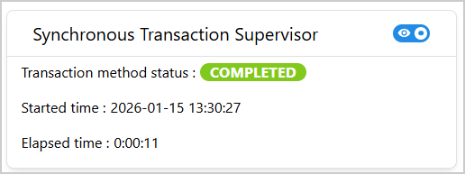
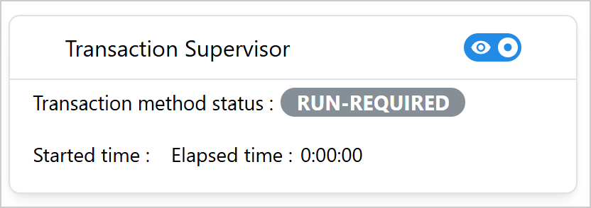
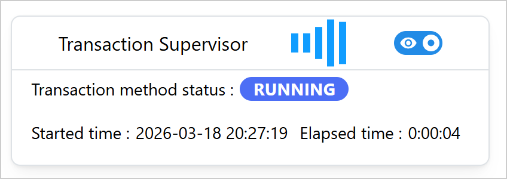
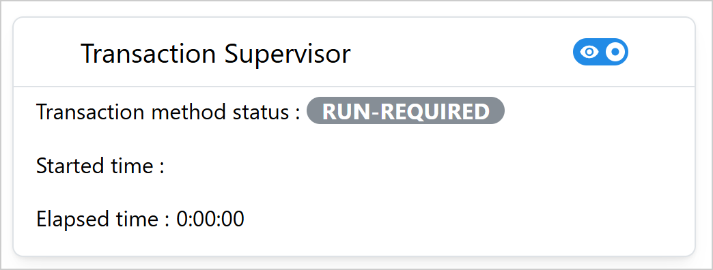

.. _ref_transaction_supervisor:

Transaction Supervisor
######################

``TransactionSupervisor`` is a Dash All-in-One (AIO) component for monitoring the status of a SAF
GLOW transaction method in real-time. It provides a visual interface for tracking the progress and
status of the method execution. The component supports both synchronous and asynchronous
(long-running) methods.

Key features:

- **Real-time status monitoring**: Automatic polling of the GLOW API to
  track method status in real time.
- **Visual status badges**: Color-coded badges indicating running,
  completed, failed, and run-required states.
- **Elapsed time tracking**: Displays elapsed time since the method
  started.
- **Started time display**: Shows the timestamp when the method began
  execution.
- **Toggle visibility**: Option to hide or show the monitoring panel.
- **Customizable appearance and layout**: Configurable title,
  dimensions, orientation, and font sizes.

Usage
=====

.. warning::

    The ``TransactionSupervisor`` component can only be used as part of a SAF-based solution. It
    requires access to the GLOW API server to monitor transaction method status.

Basic usage
-----------

The following example assumes the existence of an application with a solution definition named
``MySolution``, at least one step model named ``my_step``, and a transaction method named
``my_method`` which computes an output value ``output``.

Import ``TransactionSupervisor``:

.. literalinclude:: ../../../examples/user_guide/super_components_with_saf/src/ansys/solutions/super_components_with_saf/ui/app.py
   :language: python
   :start-after: # [imports-supervisor-start]
   :end-before: # [imports-supervisor-end]

The ``TransactionSupervisor`` cannot be directly added to the page layout. It must be initialized
via a callback triggered on page load because it needs access to the project URL.

.. literalinclude:: ../../../examples/user_guide/super_components_with_saf/src/ansys/solutions/super_components_with_saf/ui/app.py
   :language: python
   :start-after: # [layout-supervisor-start]
   :end-before: # [layout-supervisor-end]

.. literalinclude:: ../../../examples/user_guide/super_components_with_saf/src/ansys/solutions/super_components_with_saf/ui/app.py
   :language: python
   :start-after: # [add-transaction-supervisor-callback-start]
   :end-before: # [add-transaction-supervisor-callback-end]

The following output is expected:

.. _ref_activate_monitoring_example_transaction_supervisor:

Activate monitoring
~~~~~~~~~~~~~~~~~~~

In this example, the transaction method is triggered when the user clicks the "Run method" button.
Assuming that the transaction method is synchronous (that is, it runs and completes within the same
callback), the monitoring needs to be activated in a separate callback that listens to the same
button click.

To activate the monitoring, set the ``activate_monitoring`` store to ``True``:

.. literalinclude:: ../../../examples/user_guide/super_components_with_saf/src/ansys/solutions/super_components_with_saf/ui/app.py
   :language: python
   :start-after: # [activate-transaction-supervision-callback-start]
   :end-before: # [activate-transaction-supervision-callback-end]

When the button is clicked, the supervisor starts monitoring the method status, records the start
time, and updates the elapsed time while the method is running. When the method is running, the
expected output is similar to the following:

Note that this example calls the transaction method and activates monitoring in two separate
callbacks. For asynchronous ("long-running") transaction methods, starting the transaction method
and activating the badge monitoring can be done in a single callback, as shown in
:ref:`ref_activate_monitoring_example_transaction_method_status_badge` for the
``TransactionMethodStatusBadge`` component.

.. warning::

    Make sure to not trigger a synchronous transaction method again while it is still running and
    being monitored, as this can lead to unexpected behavior.

Advanced usage
--------------

The following example shows a more customized ``TransactionSupervisor`` with a custom title,
dimensions, orientation, and font sizes:

.. literalinclude:: ../../../examples/user_guide/super_components_with_saf/src/ansys/solutions/super_components_with_saf/ui/app.py
   :language: python
   :start-after: # [add-transaction-supervisor-advanced-callback-start]
   :end-before: # [add-transaction-supervisor-advanced-callback-end]

The following output is expected:

How it works
------------

1. **Initialization**: The component is created with the GLOW API URL and method details
2. **Activation**: When ``activate_monitoring`` is set to ``True``, supervision begins
3. **Polling**: The component polls the GLOW API every second (1000 ms interval) to check
   method status
4. **Status Updates**: The badge color changes based on status:
   - **Gray**: run-required (method hasn't been executed yet)
   - **Blue**: running (method is currently executing)
   - **Lime**: completed (method finished successfully)
   - **Red**: failed (method encountered an error)
5. **Auto-stop**: Supervision automatically stops when the method completes or fails
6. **Time Tracking**: Started time and elapsed time are tracked and displayed during execution

Properties
==========

Constructor parameters
----------------------

===============  ==============================================================  ==========  ========
Parameter        Description                                                     Type        Required
===============  ==============================================================  ==========  ========
url              The URL of the GLOW API server. Typically obtained from         str         Yes
                 ``project.url``.
step_name        The name of the GLOW step (StepModel) that contains the         str         Yes
                 method.
method_name      The name of the GLOW transaction method whose status is being   str         Yes
                 monitored.
title            The title displayed in the card component header.               str         No
                 Default: ``"Transaction Supervisor"``.
show             Initial visibility state of the monitoring panel.               bool        No
                 Default: ``True``.
aio_id           The unique identifier for the component. If not provided, a     str         No
                 UUID is generated.
width            The width of the card component.                                str or int  No
                 Default: ``400``.
font_size        The font size for text content in the card.                     str         No
                 Default: ``"14px"``.
title_font_size  The font size for the card title.                               str         No
                 Default: ``"16px"``.
orientation      Layout orientation of the monitoring fields. Can be             str         No
                 ``"horizontal"`` or ``"vertical"``.
                 Default: ``"horizontal"``.
===============  ==============================================================  ==========  ========

Component IDs
-------------

The component exposes the following IDs for use in callbacks:

- ``TransactionSupervisor.ids.activate_monitoring(aio_id)``: Store that triggers monitoring
  activation (set ``data`` to ``True``).
- ``TransactionSupervisor.ids.transaction_status_badge(aio_id)``: Badge displaying current status
- ``TransactionSupervisor.ids.switch(aio_id)``: Switch for toggling panel visibility
- ``TransactionSupervisor.ids.started_time_label(aio_id)``: Label showing when the method started
- ``TransactionSupervisor.ids.elapsed_time_label(aio_id)``: Label showing elapsed time

Status badge colors
-------------------

The transaction status badge uses the following color scheme:

=============  =======  ==================================================================
Status         Color    Description
=============  =======  ==================================================================
run-required   Gray     Method has not been executed yet
running        Indigo   Method is currently executing
completed      Lime     Method finished successfully
failed         Red      Method encountered an error during execution
=============  =======  ==================================================================

Limitations
===========

- The component **cannot** be initialized directly in the page layout. It must be added via a
  callback triggered on page load to access the project URL.
- The component requires a running GLOW API server to function properly.
- As the timing information is tracked on the frontend, the elapsed time can only
  be tracked reliably when the user stays on the same page during the method execution.
  When the user navigates away from the page and returns back, the elapsed time can only be
  calculated correctly when the method is still running.
  If the method has already completed or failed, the elapsed time is thus not displayed.
- For the same reason, the timing information can only be tracked reliably when the method is
  triggered and monitored from the same page, and when the supervisor is always activated when the
  method is triggered. If the method was triggered from a different page than
  the one where the supervisor is initialized, or if the transaction has been run without the
  supervisor being activated, the displayed time information may be wrong.
- When the user switches to another project, the timing information is not preserved.
- The polling interval is fixed at 1000 ms (1 second) and cannot be customized.

Full example
============

For a complete working example demonstrating synchronous method monitoring with success and error
cases, check out the `showcase example
<https://github.com/ansys/super-components-for-dash/blob/main/examples/showcase_all/src/ansys/solutions/showcase_dash_super_components/ui/pages/transaction_supervisor_page.py>`_.

The example shows:

- Two ``TransactionSupervisor`` components initialized on page load, both monitoring the
  same ``compute_sum`` method
- Triggering the computation with success or with a forced failure to demonstrate both
  successful and failed outcomes
- A default supervisor using only the required constructor arguments
- A customized supervisor with a fixed width, larger font sizes, vertical orientation, and a
  custom title

For a minimal self-contained runnable example, see the
:ref:`sphx_glr_examples_saf_based_example_transaction_supervisor.py` page in the Examples gallery.

Source code
===========

For the full API reference of ``TransactionSupervisor``, see
:class:`~ansys.solutions.dash_super_components.TransactionSupervisor`.

Check out the `component source code <https://github.com/ansys/super-components-for-dash/blob/main/src/ansys/solutions/dash_super_components/transaction_supervisor.py>`_
to discover the underlying logic. Contributions are welcomed. You can extend the component
functionalities by raising a pull request in the
`super-components-for-dash <https://github.com/ansys/super-components-for-dash>`_ repository.
