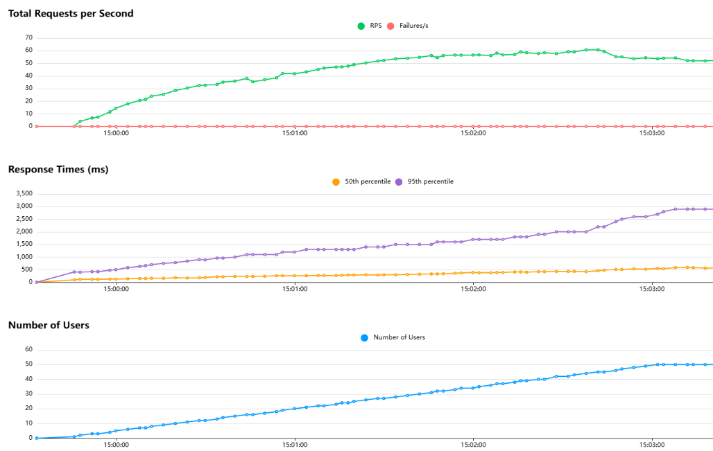
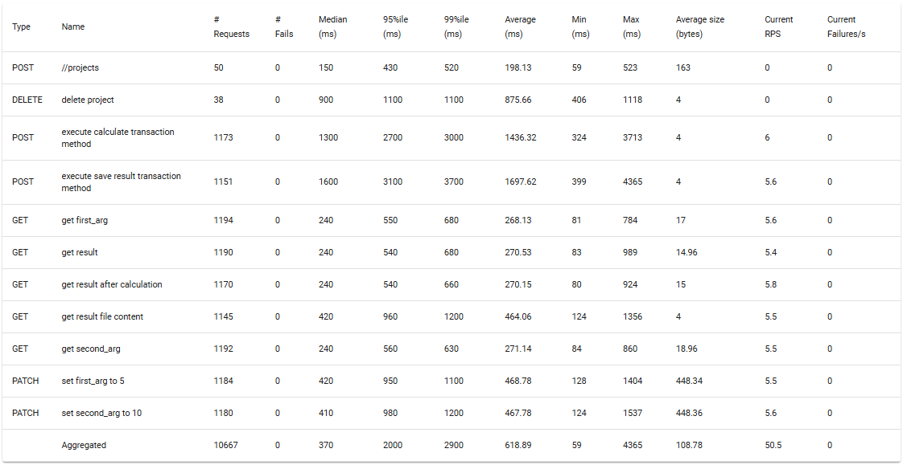

# Scalability Analysis

This page describes an experimental observation of the performance of a simplified SAF Solution On-Prem docker compose deployment. Performance was measured as load was increased and resources, in the form of server worker processes, were added to the configuration.

Two analyses were performed:

- [the GLOW API server alone](#glow-rest-api-scalability); and
- [the GLOW UI and API servers combined](#glow-dash-ui-server-scalability).

Each analysis was run with a different load using different load generation and performance measurement tools.
The setup of these tools is described.
These analyses used the same [solution](#solution-code), [hardware + OS](#hardware-and-platform-specifications) and [package configuration](#package-versions).

The results, for the [API](#api-server-analysis-results) and [UI](#ui-server-analysis-results) servers, show that the GLOW servers are able to provide more performance as server processes are made available.

The tests and the test environment were very simple relative to a real solution and deployment.
See [this section](#limitations) for a discussion of these limitations and next steps.

All the test processes described below were run in WSL.

## Hardware and Platform specifications

The scalability tests were performed on a Dell Precision 7680 laptop with the following specifications:

- WSL: Ubuntu 22.04.3 LTS (GNU/Linux 6.6.87.2-microsoft-standard-WSL2 x86_64)
- Host OS: Windows 11 Enterprise 64-bit operating system (using a legacy Ansys configuration)
    - Version 10.0.26100 Build 26100
- 64.0 GB RAM
- CPU: 13th Gen Intel Core i7-13850HX (2.10 GHz)
   - 20 Cores (8 Performance cores and 12 Efficient cores)

## Solution Code

A solution was created using the ``saf new`` and ``saf install`` commands.
The solution code was not modified.

## Package Versions

### For Node.js

- Artillery: 2.0.30
- Node.js:   v24.14.1

### For Python:
```
accessible-pygments==0.0.5
aiofiles==23.2.1
aiohappyeyeballs==2.6.1
aiohttp==3.13.3
aiomysql==0.3.2
aioshutil==1.5
aiosignal==1.4.0
aiosqlite==0.19.0
alabaster==0.7.16
altgraph==0.17.4
annotated-doc==0.0.3
annotated-types==0.7.0
ansys-api-platform-instancemanagement==1.1.3
ansys-bdm-api==0.3.1
ansys-bdm-shared-volume==0.2.0
ansys-hps-client==0.11.1
ansys-hps-data-transfer-client==0.3.1
ansys-iam-oidc==0.6.0
ansys-minerva-python-client==0.3.1
ansys-platform-instancemanagement==1.1.2
ansys-saf-aspire==9.1.6
ansys-saf-desktop-installer==1.11.1
ansys-saf-desktop-orchestrator==1.8.0
ansys-saf-glow-engine==1.37.0
ansys-saf-pim-light-server==0.3.12
ansys-saf-portal==1.2.dev7
ansys-saf-product-configuration==0.16.0
ansys-saf-product-manager==0.1.dev11
ansys-saf-testing==0.6.1
ansys-solutions-dash-super-components==0.2.dev2
ansys-sphinx-theme==1.7.1
ansys-translation-utilities==0.2.0
anyio==4.9.0
apeye==1.4.1
apeye-core==1.1.5
ariadne==0.26.2
asgiref==3.8.1
astroid==3.3.11
async-timeout==5.0.1
asyncio-atexit==1.0.1
asyncpg==0.30.0
attrs==25.3.0
autodoc_pydantic==2.2.0
autodocsumm==0.2.6
babel==2.17.0
backoff==2.2.1
backports.tarfile==1.2.0
beautifulsoup4==4.13.4
bidict==0.23.1
black==25.12.0
bleach==6.2.0
blinker==1.9.0
bottle==0.13.3
brotli==1.2.0
bson==0.5.10
build==0.8.0
CacheControl==0.14.3
cachelib==0.13.0
cachetools==6.0.0
certifi==2025.4.26
cffi==2.0.0
chardet==5.2.0
charset-normalizer==3.4.2
click==8.2.1
codespell==2.4.1
colorama==0.4.6
ConfigArgParse==1.7.5
coverage==6.5.0
cryptography==46.0.5
cssutils==2.11.1
dash==2.18.2
dash-bootstrap-components==1.7.1
dash-core-components==2.0.0
dash-extensions==1.0.20
dash-html-components==2.0.0
dash-iconify==0.1.2
dash-table==5.0.0
dash_ag_grid==31.3.1
dash_mantine_components==2.6.0
dash_uploader==0.6.1
dataclass-wizard==0.30.1
debugpy==1.8.14
defusedxml==0.7.1
Deprecated==1.2.18
dict2css==0.3.0.post1
distlib==0.3.9
docutils==0.21.2
domdf_python_tools==3.10.0
EditorConfig==0.17.0
exceptiongroup==1.3.0
execnet==2.1.1
fastapi==0.120.2
fastjsonschema==2.21.1
filelock==3.24.3
flake8==7.3.0
Flask==3.0.3
Flask-Caching==2.3.1
flask-cors==6.0.2
Flask-Login==0.6.3
frozenlist==1.6.0
gevent==25.9.1
geventhttpclient==2.3.9
googleapis-common-protos==1.70.0
gql==3.5.3
graphql-core==3.2.5
greenlet==3.2.2
grpcio==1.71.0
grpcio-health-checking==1.62.3
gunicorn==25.3.0
h11==0.16.0
html5lib==1.1
httpcore==1.0.9
httpx==0.27.2
humanfriendly==10.0
idna==3.10
imagesize==1.4.1
importlib_metadata==8.4.0
importlib_resources==6.5.2
iniconfig==2.1.0
isort==7.0.0
itsdangerous==2.2.0
jaraco.classes==3.4.0
jaraco.context==6.0.1
jaraco.functools==4.1.0
jeepney==0.9.0
Jinja2==3.1.6
joserfc==1.3.1
jsbeautifier==1.15.4
jsonschema==4.24.0
jsonschema-specifications==2025.4.1
jupyter_client==8.6.3
jupyter_core==5.8.1
jupyterlab_pygments==0.3.0
keyring==25.6.0
locust==2.43.3
markdown-it-py==3.0.0
MarkupSafe==3.0.2
marshmallow==3.26.2
marshmallow-oneofschema==3.2.0
mccabe==0.7.0
mdurl==0.1.2
mistune==3.1.3
mock==4.0.3
more-itertools==10.7.0
msgpack==1.1.0
multidict==6.4.4
mypy_extensions==1.1.0
narwhals==1.41.0
natsort==8.4.0
nbclient==0.10.2
nbconvert==7.17.0
nbformat==5.10.4
nbsphinx==0.9.8
nest-asyncio==1.6.0
networkx==3.4.2
nh3==0.2.21
numpy==2.2.6
numpydoc==1.10.0
oauthlib==3.2.2
opentelemetry-api==1.27.0
opentelemetry-exporter-otlp==1.27.0
opentelemetry-exporter-otlp-proto-common==1.27.0
opentelemetry-exporter-otlp-proto-grpc==1.27.0
opentelemetry-exporter-otlp-proto-http==1.27.0
opentelemetry-instrumentation==0.48b0
opentelemetry-instrumentation-asgi==0.48b0
opentelemetry-instrumentation-fastapi==0.48b0
opentelemetry-instrumentation-flask==0.48b0
opentelemetry-instrumentation-httpx==0.48b0
opentelemetry-instrumentation-logging==0.48b0
opentelemetry-instrumentation-wsgi==0.48b0
opentelemetry-proto==1.27.0
opentelemetry-sdk==1.27.0
opentelemetry-semantic-conventions==0.48b0
opentelemetry-util-http==0.48b0
outcome==1.3.0.post0
packaging==24.2
pandas==2.2.3
pandocfilters==1.5.1
pathspec==0.12.1
pdf2image==1.17.0
pep517==0.13.1
pep8==1.7.1
pillow==12.1.1
pkg-about==1.1.8
pkginfo==1.12.1.2
platformdirs==4.3.8
plotly==6.1.2
pluggy==1.6.0
portend==3.2.1
propcache==0.3.1
protobuf==4.25.8
proxy_tools==0.1.0
psutil==6.1.1
pyc-wheel==1.2.7
pycodestyle==2.14.0
pycparser==2.22
pycryptodome==3.23.0
pydantic==2.10.6
pydantic-settings==2.9.1
pydantic_core==2.27.2
pydata-sphinx-theme==0.16.1
pydocstyle==6.3.0
pyflakes==3.4.0
Pygments==2.19.1
pyinstaller==6.17.0
pyinstaller-hooks-contrib==2025.10
PyJWT==2.10.1
PyMySQL==1.1.1
pyproject-api==1.9.0
PySocks==1.7.1
pytest==8.4.2
pytest-cache==1.0
pytest-cov==3.0.0
pytest-dependency==0.5.1
pytest-flakes==4.0.5
pytest-mock==3.15.1
pytest-pep8==1.0.6
pytest-pythonpath==0.7.3
pytest-xdist==3.8.0
python-dateutil==2.9.0.post0
python-dotenv==1.1.0
python-engineio==4.13.1
python-multipart==0.0.22
python-socketio==5.16.1
pytokens==0.3.0
pytz==2025.2
pywebview==4.4.1
PyYAML==6.0.2
pyzmq==26.4.0
readme_renderer==44.0
referencing==0.36.2
requests==2.32.4
requests-oauthlib==2.0.0
requests-toolbelt==1.0.0
retrying==1.3.4
rfc3986==2.0.0
rich==14.0.0
roman==5.2
rpds-py==0.25.1
ruamel.yaml==0.18.11
ruamel.yaml.clib==0.2.12
SecretStorage==3.3.3
selenium==4.32.0
simple-websocket==1.1.0
six==1.17.0
sniffio==1.3.1
snowballstemmer==3.0.1
sortedcontainers==2.4.0
soupsieve==2.7
Sphinx==8.1.3
sphinx-autoapi==3.7.0
sphinx-autodoc-typehints==2.5.0
sphinx-code-tabs==0.5.5
sphinx-copybutton==0.5.2
sphinx-gallery==0.20.0
sphinx-jinja==2.0.2
sphinx-jinja2-compat==0.3.0
sphinx-markdown-builder==0.6.9
sphinx-prompt==1.9.0
sphinx-tabs==3.4.5
sphinx-toolbox==4.1.0
sphinx_design==0.6.1
sphinxcontrib-applehelp==2.0.0
sphinxcontrib-devhelp==2.0.0
sphinxcontrib-htmlhelp==2.1.0
sphinxcontrib-jsmath==1.0.1
sphinxcontrib-mermaid==1.2.3
sphinxcontrib-qthelp==2.0.0
sphinxcontrib-serializinghtml==2.0.0
sphinxcontrib-video==0.4.1
sphinxemoji==0.3.1
SQLAlchemy==2.0.41
starlette==0.49.1
stream-zip==0.0.83
tabulate==0.9.0
tempora==5.8.1
tenacity==8.5.0
tinycss2==1.4.0
toml==0.10.2
tomli==2.2.1
tornado==6.5.1
tox==4.27.0
traitlets==5.14.3
trio==0.31.0
trio-websocket==0.12.2
twine==6.0.1
typing-inspection==0.4.1
typing_extensions==4.15.0
tzdata==2025.2
urllib3==2.6.3
uvicorn==0.34.2
vale==3.13.0.0
virtualenv==20.36.1
webencodings==0.5.1
websocket-client==1.9.0
Werkzeug==3.0.6
wrapt==1.17.2
wsproto==1.2.0
yarl==1.20.0
zipp==3.22.0
zope.event==6.1
zope.interface==8.2
```


## GLOW REST API scalability

In this analysis we evaluated the scalability of the GLOW REST API alone without a UI server.

The test consisted of adding concurrent virtual users to a pool at the rate of one user every 4 seconds up to a total of 50 users. The slow spawn rate was used to demonstrate the linear relationship between the number of users and the response times.
The benchmark results were measured at the point when the last user was created. The users operated the API server directly via its REST API. Each user first created a project file, fetched the values of fields, set the value of fields, executed transaction methods and fetched the value of fields.
Each user ran this process indefinitely until the end of the over all test.
The process does not contain any delay between steps.
The definition of the user process is [below](#locust-test-script).

### Configuring Postgres

The file ``deployments/standalone/compose.yaml`` in the solution was altered so that the postgresql service was configured to include an explicit command which sets the Postgres configuration.
This change was required to avoid the postgres container from exhausting the number of connections.

The complete service definition was as follows:

```
  scaling_0-0-0-postgresql:
    image: postgres:16.0
    networks:
      - scaling_0-0-0-internal
    environment:
      - POSTGRES_USER=glow
      - POSTGRES_PASSWORD=glow
    healthcheck:
      test: [ "CMD", "pg_isready", "-U", "glow" ]
      interval: 5s
      retries: 20
    volumes:
      - scaling_0-0-0-database:/var/lib/postgresql/data
    command: ["postgres", "-c", "max_connections=500", "-c", "shared_buffers=2GB"]

```

The only change is the addition of the ``command`` key.

This specific change has been recorded in GitHub at https://github.com/ansys/saf-cli/issues/180 but has not been implemented in the SAF code base.
There needs to be an equivalent change in the Platform Builder compose file.

### Adding Locust

The solution was extended by adding the ``locust`` package as a testing dependency to the solution:

``` bash
poetry add locust --group=tests
```

### Locust Test Script

The ``tests/locust/locustfile.py`` file was created with the content:

``` python
from locust import HttpUser, task

class SolutionRestApiUser(HttpUser):

    @task
    def execute_transaction_method(self):
        # simulate opening and using the first page of the solution

        # get step field values
        self.client.get(f"/{self._project_name}/steps/first-step?fields=first_arg", name="get first_arg")
        self.client.get(f"/{self._project_name}/steps/first-step?fields=second_arg", name="get second_arg")
        self.client.get(f"/{self._project_name}/steps/first-step?fields=result", name="get result")

        # set new step input field values
        self.client.patch(f"/{self._project_name}/steps/first-step", json={"first_arg": 5}, name="set first_arg to 5")
        self.client.patch(f"/{self._project_name}/steps/first-step", json={"second_arg": 10}, name="set second_arg to 10")

        # execute calculate transaction method
        self.client.post(f"/{self._project_name}/steps/first-step:calculate", name="execute calculate transaction method")

        # get result field value
        self.client.get(f"/{self._project_name}/steps/first-step?fields=result", name="get result after calculation")

        # execute save result transaction method
        self.client.post(f"/{self._project_name}/steps/first-step:save-result", name="execute save result transaction method")

        # get result file content
        self.client.get(f"/{self._project_name}/steps/first-step/blobs/result-file", name="get result file content")


    def on_start(self):
        # create new project
        response = self.client.post("/projects", json={"display_name": "Test Project"})
        self._project_name = response.json()["name"]

    def on_stop(self):
        # delete project
        self.client.delete("/" + self._project_name, name="delete project")
```

### Test Procedure

The tests were run in WSL as follows:

- alter the value of ``GLOW_API_NUMBER_OF_WORKERS`` in ``deployments/standalone/.env``
- start the SAF SDK server stack by running:

``` bash
cd deployments/standalone
docker compose up -d
```

- start the locust UI by running:

``` bash
cd tests/locust
locust
```

- open the locust UI at http://localhost:8089
- in the locust UI set:
   - the number of users to 50
   - the spawn rate to 0.25
   - the host to http://localhost:8000 (this is the GLOW server REST end point)
- press "START"
- view the results in the locust UI


### API Server Analysis Results

The above procedure was run for 1, 4, 8, and 16 workers (via the ``GLOW_API_NUMBER_OF_WORKERS`` environment variable).
Results are captured at the point when 50 users are active.
Response times increased linearly with the number of users in all cases.  The 95 percentile was dominated by the transaction methods.

| Number of workers | 50 percentile response time (ms) | 95 percentile response time (ms) | Requests per second |
|-------------------|----------------------------------|----------------------------------|---------------------|
| 1                 | 1200                             | 15000                            | 11.7                |
| 4                 | 850                              | 4400                             | 32.1                |
| 8                 | 560                              | 2800                             | 51.8                |
| 16                | 550                              | 2700                             | 53.6                |

The following is the Locust plot for the test with 16 workers:



The following is the Locust summary data from an equivalent run with 16 workers:



## GLOW DASH UI Server scalability

In this analysis we evaluated the performance of the SAF GLOW UI and API servers using
mock users running headless browsers to check the end user visible performance.

The test consisted of adding concurrent virtual users to a pool at the rate of one user every 4 seconds up to a total of 10 users.  Each user had the same fixed task.
The test ended when all the users had completed their task.
The benchmark results were measured at the test end.

The test was orchestrated and results gathered by the [Artillery](https://www.artillery.io) tool.

Each virtual user operated a headless browser via the [Playwright API](https://playwright.dev).  Each user first created a project file via the GLOW API server's OpenAPI UI, navigated to the solution page for the project, navigated to the first page of the solution, set the value of fields and executed 2 transaction methods via button clicks.
(Field values are implicitly fetched from the API server to enable the rendering of the solution UI.)  The process of setting field values and executing transaction methods was repeated 30 times by each user.
The process did not contain any delay between steps.

The definition of the user process is [below](#artillery-test-script).

The UI test profile is different from the API test profile in the following ways:

- there's only 10 virtual users
- the use of headless browsers running the DASH javascript client creates additional CPU load hence the limited number of users
- the users don't run indefinitely
- the test runs until all the users complete their tasks
- the Dash server uses the GLOW python client which invokes the GraphQL endpoint when patching field values whereas the REST test uses a REST PATCH
- user task execution time is the primary measure of performance
- the number of GLOW API server workers was fixed to 16
- the postgres compose command was not modified (an oversight that does not appear to be significant at the API loads that applied in the UI test)

Although there are only 10 virtual users, given that the virtual users do not delay between steps, the load represents a much higher number of real users.

### Replacing ``waitress`` with ``gunicorn`` as UI server

Waitress, the server engine used in the GLOW on-prem deployment, does not support worker processes and is not regarded as suitable for high production loads so the following changes were made to the solution:

#### Change UI Docker Entry point

In ``deployments/Dockerfile`` the entry point for the UI server (the last line) is replaced with

``` docker
ENTRYPOINT poetry run python -m gunicorn -b $GLOW_UI_HOST:$GLOW_UI_PORT --workers ${GLOW_UI_NUMBER_OF_WORKERS:-8} ansys.saf.glow.ui:app
```

#### Change deployment configuration

A setting was added to `deployments/standalone/.env` for ``GLOW_UI_NUMBER_OF_WORKERS``

#### Add ``gunicorn`` to project

As follows:

``` bash
poetry add gunicorn
```

The following GitHub stories have been added to cover the above changes:
- https://github.com/ansys/glow-engine/issues/150
- https://github.com/ansys/saf-cli/issues/179

but have not been implemented.

### Adding Artillery

In WSL:

#### Download and install nvm

``` bash
curl -o- https://raw.githubusercontent.com/nvm-sh/nvm/v0.40.4/install.sh | bash

# in lieu of restarting the shell
\. "$HOME/.nvm/nvm.sh"

# Download and install Node.js:
nvm install 24
```

#### Download and install Artillery

``` bash
cd tests/playwright/

npm install -g artillery@latest
```

### Artillery Test Script

The content of ``tests/playwright/tests/artillery.ts`` was as follows:

``` typescript
import { type Config, type Scenario } from 'artillery';
import { test, expect } from '@playwright/test';

export const config: Config = {
  target: 'https://www.artillery.io',
  engines: {
    playwright: {
      // Enable Playwright trace recording
      // Requires an Artillery Cloud account for viewing traces:
      // https://www.artillery.io/docs/get-started/get-artillery#set-up-cloud-reporting
      timeout: 60000, // Timeout for each request (in ms)
      defaultTimeout: 60000, // Default timeout for Playwright actions
      browser: 'chromium',

    }
  },
  phases: [
    {
      name : 'Ramp',
      arrivalCount: 10,
      duration: 40
    },
  ],

};

export const scenarios: Scenario[]  = [{
  engine: 'playwright',
  testFunction: scenario
}];

async function scenario(page, vuContext, events, test) {

  let project = ""
  let step_name = ""
  const { step } = test;

  await step('Open the API docs page', async () => {
    step_name = "Open API docs page"
    await page.goto('http://localhost:8000/docs');
  });

  await step('Create a new project', async () => {
    step_name = "Create a new project"
    await page.getByRole('button', { name: 'post /projects', exact: true }).click();
    await page.getByRole('button', { name: 'Try it out' }).click();
    await page.getByRole('button', { name: 'Execute' }).click();
    const downloadPromise = page.waitForEvent('download');
    await page.getByRole('button', { name: 'Download', exact: true }).click();
    const download = await downloadPromise;
    const stream = await download.createReadStream();
    let string = '';
    for await (const chunk of stream) {
        string += chunk;
    }
    const response = JSON.parse(string);
    expect(response).toHaveProperty('name');
    project = response.name;
    expect(project).toContain('projects/');
  });

  await step('Open project page', async () => {
    step_name = "Open project page"
    await page.goto(`http://localhost:8001/${project}`);
  });

  await step('Navigate to first page', async () => {
    step_name = "Navigate to first page"
    await page.locator('[id="{\\"aio_id\\":\\"navigation_tree\\",\\"component\\":\\"navlink_item\\",\\"index\\":\\"first_page\\"}"]').click();
  });

  for (let i = 0; i < 30; i++) {

    await step('Enter arguments', async () => {
        step_name = "Enter arguments"
        await page.getByRole('textbox', { name: 'First Argument' }).click();
        await page.getByRole('textbox', { name: 'First Argument' }).fill('1');
        await page.getByRole('textbox', { name: 'Second Argument' }).click();
        await page.getByRole('textbox', { name: 'Second Argument' }).fill('2');
    });

    await step('Calculate', async () => {
        step_name = "Calculate"
        await page.getByRole('button', { name: 'Calculate' }).click();
        await expect(page.getByRole('textbox', { name: 'Result', exact: true })).toHaveValue('3', { timeout: 60000 });
    });
    await step('Store result', async () => {
        step_name = "Store result"
        await page.getByRole('button', { name: 'Store result' }).click();
    });

    await step('Load stored result', async () => {
      step_name = "Load stored result"
      await page.getByRole('button', { name: 'Load stored result' }).click();
      await expect(page.getByRole('textbox', { name: 'Stored result', exact: true })).toHaveValue('3', { timeout: 60000 });
    });
  }

}
```
The above script was created with the aid of the Playwright code generator by running

```bash
npx playwright codegen http://localhost:8000/docs
```

This pops up a browser window where you can record interactions as playwright typescript.  You can switch to the Solution UI by entering the UI endpoint for the solution project in the browser window once the project is created (as you would expect).  The grouping into steps was added manually to the generated code.

### Test Procedure

The tests were run in WSL as follows:

- alter the value of ``GLOW_UI_NUMBER_OF_WORKERS`` in ``deployments/standalone/.env``
- start the SAF SDK server stack by running:

``` bash
cd deployments/standalone
docker compose up -d
```

- run the test script:

``` bash
artillery run tests/playwright/tests/artillery.ts --output user.json
```
- saving the tail of the output from the above command that contains a summary of the run to a file

- generating an HTML file ``user.json.html`` containing plots of the result from that particular run:
``` bash
npx artillery@2.0.21 report user.json
```

An older version of Artillery is used for the report command because the command is missing from later versions of Artillery.

### UI Server Analysis Results

| Number of workers |  Average Scenario Duration (ms) |  Average Scenario Duration (minutes) |  Link to detailed report |
|-------------------|-------------------|--------------------------------|--------------------------|
| 1   | 389185.4 | 6.49 | [detailed summary](ui-workers-1.md)                     |
| 4   | 135601.6 | 2.26 | [detailed summary](ui-workers-4.md)                    |
| 8   | 100446   | 1.67 | [detailed summary](ui-workers-8.md)                    |
| 16  | 102011   | 1.70 | [detailed summary](ui-workers-16.md)                 |

## Limitations

The above tests do not cover a number of SAF features including:

- events raised by transaction methods
- large file uploads and downloads
- use of product instances
- submission of HPS jobs
- multiple users interacting with the same project
- rendering and modification of large field values
- deployment to K8S
- authentication and authorization

Further testing involving those features would be useful.

In addition the means of testing could be improved by:

- Running the servers and load generators (Locust and Artillery) on different nodes perhaps even using multiple nodes for load generation in the case of Artillery.  Once this is in place the number of users in a UI server load test can be increased significantly.
- Using OTEL tools such as Grafana to examine the server behaviour under load.
- Determining how to refactor or reconfigure the Dash server to generate OTEL for its incoming HTTP requests


